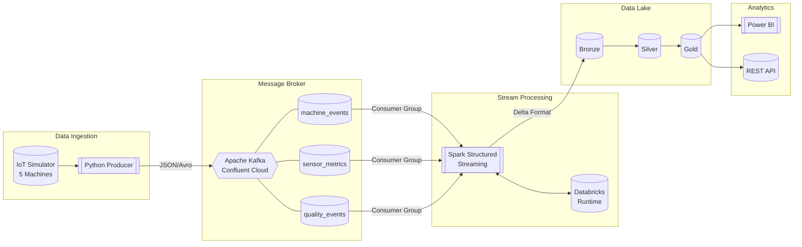
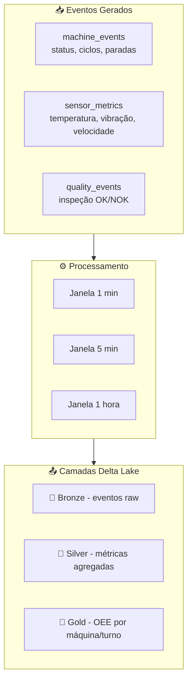

# Pipeline IoT/OEE - Streaming Architecture

Pipeline de streaming para monitoramento de OEE (Overall Equipment Effectiveness) em tempo real, simulando dados de sensores industriais.

## Arquitetura

## Fluxo de Dados

## Componentes

| Componente | Tecnologia | Descrição |
|------------|------------|-----------|
| Producer | Python | Simula máquinas industriais gerando eventos |
| Broker | Confluent Cloud (Kafka) | Gerencia streaming dos eventos |
| Processamento | Spark Structured Streaming | Calcula OEE em tempo real |
| Storage | Delta Lake | Armazena dados em camadas Bronze/Silver/Gold |
| Visualização | Power BI | Dashboard de monitoramento |

## Métricas OEE

O OEE é calculado como:

**OEE = Disponibilidade × Performance × Qualidade**

- **Disponibilidade**: Tempo produzindo / Tempo programado
- **Performance**: Produção real / Produção teórica
- **Qualidade**: Peças boas / Total produzido

## Stack

- Python 3.11+
- Apache Kafka (Confluent Cloud)
- Apache Spark (Databricks)
- Delta Lake
- Power BI
